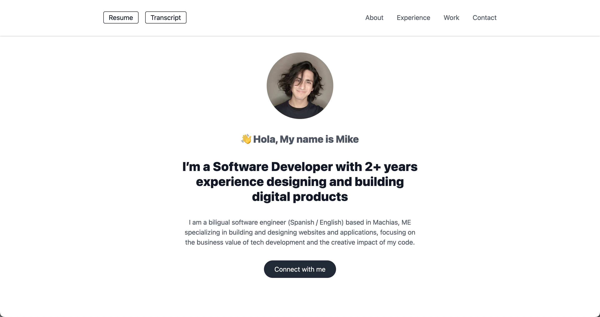

# My Personal Portfolio ⚡️
## Take a look of the code base of my current portfolio. 
This is a CRUD dynamic website implemented with a NodeJs / Express / Firebase / VanillaJs Stack.

**_IMPORTANT NOTE 1_**: I implemented this websites within 7 days as a sprint challenge! 🎉🎉🎉 
   
**_IMPORTANT NOTE 2_**: Yes, I love challenges.
<h2 align="center">
  
  
   
</h2>

## Features 💡
⚡️ Moder UI Design + Reveal Animations\
⚡️ One Page Layout\
⚡️ Styled with Tailwind and Tippy Js\
⚡️ Fully responsive\
⚡️ Optimized with Parcel\
⚡️ Well organized backend

To view the current webpage, **[click here](https://mikeguijarro.herokuapp.com/)**

## Technologies used 🛠️
- [Parcel](https://parceljs.org/getting_started.html/) - Web application bundler
- [Firebase - Realtime DB](https://firebase.google.com/products/realtime-database) - Backend service for realtime data sync
- [Firebase - Cloud Storage](https://firebase.google.com/products/storage) - Backend service for document storage
- [Express](https://expressjs.com/) - Backend framework for web applications
- [Handlebars](https://handlebarsjs.com/) - Frontend templating engine
- [Tailwind](https://tailwindcss.com/) - Front-end utility-first CSS framework 
- [Feather Icons](https://feathericons.com/) - Simply open source icons
- [Lax.js](https://github.com/alexfoxy/lax.js?utm_source=xinquji/) - JavaScript animations library
- [Tippy.js](https://atomiks.github.io/tippyjs/) - JavaScript tooltip library

## License 📄
This project is licensed under the MIT License - see the [LICENSE.md](LICENSE.md) file for details
Feel free to clone this project and connect it to you own firebase app. The only requirement that I asked you for is to refer me as the author and backlink my portfolio. 🤗

## Acknowledgments 🎁
I was motivated to build this project because I wanted to contribute on something useful for the jr dev community. Special thanks to [Maximilian](https://twitter.com/maxedapps), his passion for teaching is a big motivation for motivated learners like me.
